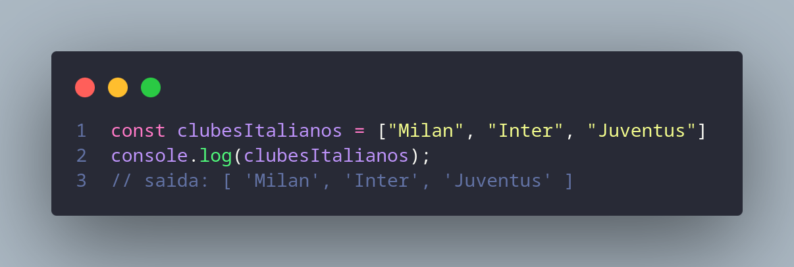
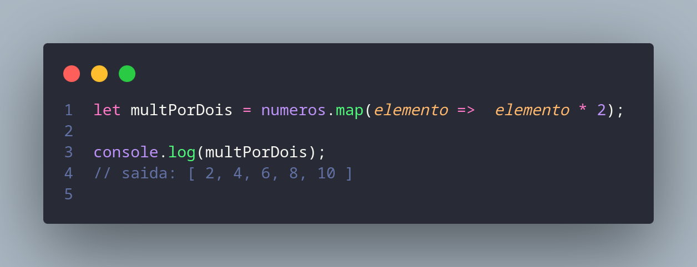

# ArrayListJs

Este projeto apresenta um tutorial simples e direto sobre como manipular coleções (listas) em JavaScript utilizando os métodos: `map`, `filter` e `reduce`.

Arrays em JavaScript são estruturas que permitem armazenar valores de qualquer tipo dentro de uma única lista.
A seguir, um exemplo básico de ArrayList:

---

# O que é um Array em JavaScript

Um array é uma lista ordenada de valores, acessada por índices numéricos.
Eles permitem armazenar múltiplos valores dentro de uma mesma variável, sendo muito utilizados em manipulação de coleções.

---

# 1. Método map()

O método `map()` percorre todos os elementos de um ArrayList aplicando uma transformação a cada item.
Ele retorna um novo array , mantendo o mesmo tamanho, porém com valores transformados.

Exemplo:

---

# 2. Método filter()

O método `filter()` cria um novo array contendo apenas os elementos que atenderem à condição definida na callback.

Exemplo:

---

# 3. Método reduce()

O método `reduce()` reduz todos os elementos do array a um único valor, acumulando resultados durante o percurso.

Exemplo somando valores:

---

